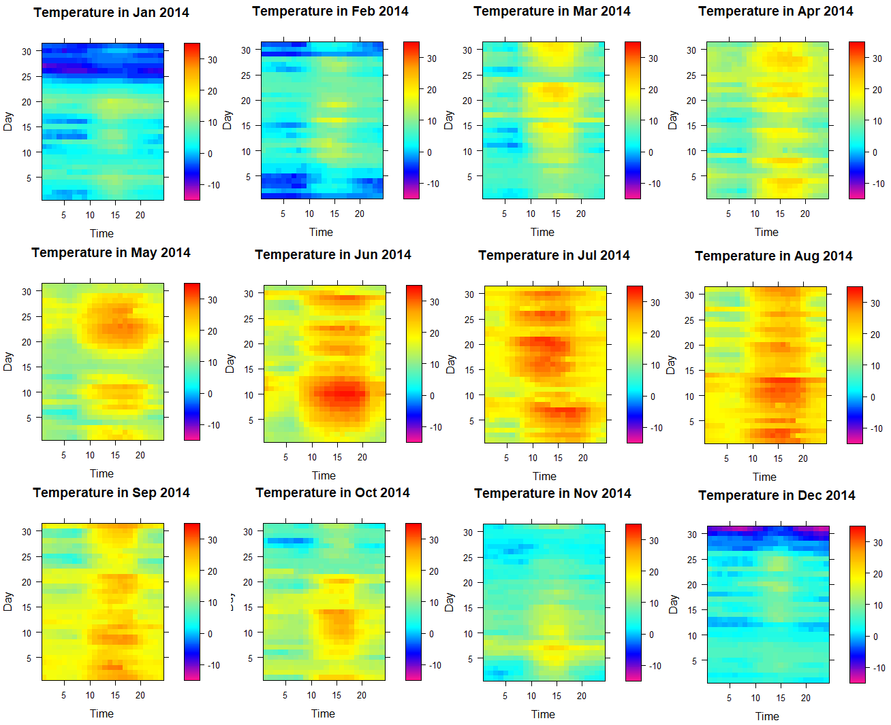

# STAT 5511 - Szeged Temperature Prediction

This is a class project for the course STAT 5511 - Regression Analysis. Our project studies the relationship between temperature and other factors such as humidity, wind speed, pressure, visibility, date, etc by building predictive models. The project uses regression analysis (SLR and MLR) and classification analysis (KNN and Random Forest). Please refer to the final report in the repository for more details.

The dataset is obtained from the Kaggle data science community. Anyone can download the dataset through this link: https://www.kaggle.com/budincsevity/szeged-weather. The src folder contains the R source code for most of the plottings in the final report and the classification models.

Team members:
  + Brady Madden
  + Eric Erdman
  + Nam Phung
  + Timothy Cowell

